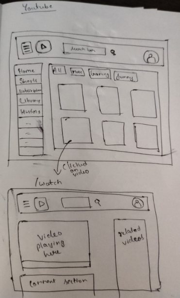

# Machine coding interview

# features ?

# tech stack

    - react
    - redux
    - react router
    - tailwind css
    - bundler
    - jest for testing

# each tech should have proper justification

# wireframe / planning the app

# both feature , tech stack discussion and planning should be max 10 min discussion

<!--

 *Header

 *Body
    SiderBar
        -MenuItems
    MainContainer
        -ButtonList
        -VideoContainer
            -VideoCard

 -->

# debouncing for search bar

- lets use cache to store the search results
- time complexicity

  - to search in array = O(n)
  - to search in obj = O(1)

  ["i","ip","iph","iphone"]

  {
  i:
  ip:
  iph:
  iphone:
  }

- we can also use map() (new map()) which is more optimised

- the search bar in the youtube header is using debouncing , live suggestion api , caching
